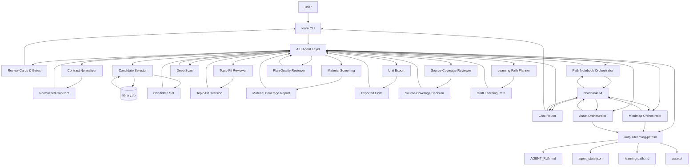

# Draft: Agent Orchestration Layer Plan

## Status

Draft, Stand: 2026-05-29.

Dieses Dokument beschreibt das Zielbild fuer eine Agent-Orchestration-Layer im AI University Produkt. Es verbindet die bestehende deterministische OCW/NotebookLM-Pipeline mit einem erklaerbaren Agenten, der Lernziele klaert, Qualitaet prueft, NotebookLM-Aktionen steuert und User durch Review Gates fuehrt.

## Zielbild

AI University wird als chat-first Self-serve Learning Product gedacht. Der erste Agent-MVP wird jedoch bewusst ueber CLI plus Markdown/JSON-Artefakte ausgeliefert, damit die vorhandene Pipeline reproduzierbar bleibt und die Produktlogik schnell testbar ist.

Der Agent ersetzt die bestehende Pipeline nicht. Er orchestriert sie:

- Er normalisiert und erweitert User-Ziele.
- Er prueft Kandidaten auf echten Topic Fit.
- Er erkennt fehlende Quellen und triggert Deep Scan sowie Unit Export.
- Er bewertet Lernpfade vor der Ausgabe.
- Er routet Chat- und Asset-Anfragen zu NotebookLM.
- Er macht technische Entscheidungen als Review Cards nachvollziehbar.

Dabei ist der Agent kein einmaliger Starter vor einer deterministischen Kette.
Er haelt den Run-State ueber alle Stufen hinweg, prueft jeden Step-Output,
entscheidet ueber Retry, Revision oder Weitergabe und startet den naechsten
Schritt erst mit einem validierten Zwischenergebnis.

NotebookLM bleibt der source-grounded Backend-Tutor. Die primaere User Experience ist aber der AIU Agent, nicht der direkte NotebookLM-Chat.

## UX-Prinzip

Der User startet mit einem Ziel, nicht mit Kurs- oder Source-IDs:

```bash
learn agent run --goal "Accounting fuer Fortgeschrittene" --current-level advanced
```

Der Agent antwortet mit erklaerbaren Cards und stoppt nur an Review Gates:

- Contract Card
- Candidate-Fit Card
- Source-Coverage Card
- Plan-Review Card
- Notebook-Readiness Card
- Next-Actions Card

Direkter NotebookLM-Chat bleibt als Dev-/Power-User-Escape-Hatch verfuegbar. Fuer normale Lernflows laeuft Chat ueber den Agent:

```bash
learn agent chat --path-id <path-id> --message "Erklaer mir Unit 2 nochmal einfacher."
```

Der Agent waehlt passende Units und Sources, ruft NotebookLM source-grounded auf und gibt die Antwort inklusive Herkunftskontext zurueck.

## Agent Responsibilities

### Step Review Loop

Jeder Pipeline-Schritt laeuft als agentisch kontrollierter Loop: Der Agent
startet den Schritt mit dem aktuellen akzeptierten State, das Tool erzeugt ein
Output-Artefakt, der Agent prueft dieses Artefakt, kann den Schritt mit
angepassten Parametern erneut starten und markiert erst danach den akzeptierten
Output fuer die naechste Stufe. Dieser Loop gilt mindestens fuer Contract
Normalizer, Candidate Selector, Topic-Fit Reviewer, Material Screening und Unit
Export.

Der Step Review Loop ersetzt keine bestehenden Tool-Entscheidungen.
Deterministische Tools entscheiden technische Validitaet und erzeugen
Artefakte. Der Agent prueft danach semantische Passung,
User-Verstaendlichkeit, didaktische Qualitaet und Recovery-Optionen. Er greift
nur ein, wenn ein formal gueltiges Artefakt produktlich unsicher ist oder ein
technischer Abbruch in eine userfaehige Entscheidung uebersetzt werden muss.

Beispiele fuer die Abgrenzung:

- Candidate Selector findet einen Kurs, weil `Accounting` im Titel steht. Der
  Agent prueft Topics und Kontext und kann den Kurs als Low-Confidence
  markieren, wenn er eigentlich Regional Economics statt Financial Accounting
  behandelt.
- Material Screening triggert bereits Rescreening und Unit Export. Der Agent
  entscheidet danach nicht erneut, ob Quellen technisch nutzbar sind, sondern
  ob die Coverage dem User als belastbarer Lernpfad erklaert werden kann oder
  ob eine breitere Suchrichtung vorgeschlagen werden sollte.
- Planner erzeugt formal gueltige Units. Der Agent prueft, ob Titel wie
  `lec1.pdf` userfaehig sind, und fordert Title Normalization oder Review an,
  bevor der Plan als final angezeigt wird.

### Goal Expansion

Der Agent uebersetzt User-Ziele in suchbare Domaenen, Synonyme, Sprache, Level und Ausschluesse. Beispiel: "Kardiologie" wird nicht nur als deutscher String gesucht, sondern als medizinisches Lernziel mit Varianten wie cardiology, cardiovascular und heart disease behandelt.

### Candidate Selection Review

Der deterministische Candidate Selector bleibt der erste Filter gegen `library.db`. Der Agent prueft danach, ob Kandidaten wirklich zum Ziel passen. Dadurch sollen Fehler wie ein Accounting-Treffer in einem Kurs zu regional economic growth sichtbar werden.

Die Loesung ist bewusst zweistufig:

1. Der Candidate Selector wird verbessert, damit offensichtliche False
   Positives seltener hoch ranken. Title-only Matches werden schwaecher
   gewichtet, Topic-Matches staerker, direkte Topic-Pfade wie
   `Business > Accounting` hoeher als ein einzelnes mehrdeutiges Titelwort.
2. Der Topic-Fit Reviewer bleibt als Gate- und Erklaerschicht bestehen. Er
   beantwortet nicht "welche Kurse ranken am besten?", sondern "kann ich dem
   User verstaendlich begruenden, dass dieser Kurs wirklich zum Lernziel
   passt?".

Der Reviewer darf keine DB-Suche selbst ausfuehren. Er liefert eine
Entscheidung und eine empfohlene naechste Aktion; der Orchestrator fuehrt diese
Aktion aus.

Topic-Fit-Entscheidungen:

- `accept`: Kandidat passt semantisch und kann weiterverwendet werden.
- `reject`: Kandidat ist ein False Positive und wird entfernt.
- `low_confidence`: Kandidat koennte passen, braucht aber User-Review oder
  niedrigere Prioritaet.
- `ambiguous_goal`: Das Lernziel ist mehrdeutig; User muss die Richtung
  waehlen.

Action-Policy:

- Wenn nach `reject` genug gute Kandidaten uebrig sind, laeuft der Agent ohne
  den Kandidaten weiter.
- Wenn nur Low-Confidence-Kandidaten uebrig sind, zeigt der Agent eine
  Candidate-Fit Card und fragt den User nach der passenden Richtung.
- Wenn keine guten Kandidaten uebrig bleiben, schlaegt der Agent
  `broaden_or_rewrite_goal` vor, z.B. breitere oder verwandte Suchrichtungen.
- `stop` ist die letzte Option und wird nur genutzt, wenn der User stoppt, kein
  sinnvoller Suchpfad bleibt oder ein Scope-/Safety-Gate greift.

Beispiel: Ein Kurs `Analyzing and Accounting for Regional Economic Growth`
kann trotz Titelwort `Accounting` als `reject` markiert werden, wenn Topics und
Beschreibung vor allem Economics, Urban Studies und Regional Planning zeigen,
das User-Ziel aber Financial Accounting meint.

### Material & Source Recovery

Wenn ein Kandidat keine nutzbaren Quellen hat, ist das kein sofortiger Produktabbruch. Der Agent stoesst Deep Scan und Unit Export an, bewertet danach die Coverage neu und erklaert verbleibende Luecken.

### Learning Path Quality Review

Der Agent prueft Unit-Reihenfolge, Level-Fit, Source-Abdeckung, falsche Kurseintraege und rohe Dateinamen. Titel wie `lec1.pdf` sollen nicht ungeprueft in den Lernpfad gelangen.

### NotebookLM Orchestration

Der Agent erstellt Path Notebooks, laedt Quellen hoch, wartet auf Source-Readiness und dokumentiert Status. NotebookLM wird als Backend fuer Chat, Mindmap und source-grounded Textassets genutzt.

### Asset Orchestration

Der Agent schlaegt passende Assets abhaengig von Lernstand und Quellenlage vor. Direkt nutzbare Textassets werden via `ask --json` erstellt. NotebookLM-native Artifacts werden mit Metadaten, Status und Download-Hinweis behandelt.

## Bestehende Bausteine

- `library.db` als lokale Source of Truth fuer Kurse und Materialien.
- Contract Normalizer fuer strukturierte Lernziele.
- Candidate Selector fuer DB-basierte Kursauswahl.
- Material Screening fuer Quellenbewertung.
- Deep Scan und Unit Export fuer bessere Source-/Unit-Coverage.
- Planner fuer deterministische Lernpfad-Erstellung.
- Path Notebook fuer NotebookLM-Erstellung, Upload und Wait/Resume.
- Mindmap-Integration fuer NotebookLM-native Orientierung.
- Chat-Wrapper fuer source-grounded NotebookLM-Antworten.
- Asset-Flow fuer User-gesteuerte Lernmaterialien.

## Neue Bausteine

- AIU Agent Layer als Orchestrator ueber der bestehenden Pipeline.
- Agent Provider Adapter fuer austauschbare Reasoning-Backends wie lokale
  Subscription-CLIs, API-Keys oder spaeter App-paid Provider.
- Step Review Loop fuer agentische Pruefung, Retry-Entscheidung und akzeptierte
  Zwischenergebnisse zwischen allen Kernschritten.
- Review Cards und Gates als erklaerbare Produktoberflaeche.
- Topic-Fit Reviewer fuer Kandidaten und Units.
- Source-Coverage Reviewer mit Recovery-Entscheidungen.
- Title Normalizer fuer rohe PDF-/Dateinamen.
- Chat Router fuer Unit-/Mindmap-/Freeform-Anfragen.
- Agent Run State als `agent_state.json` mit Step-Status, Review-Ergebnis,
  Retry-Entscheidung und akzeptierten Outputs.
- Lesbarer Run-Bericht als `AGENT_RUN.md`.

## Provider-Strategie fuer den MVP

Der MVP soll mit dem einfachsten verfuegbaren Setup starten: der lokale
AIU-Entwicklungs- und Testlauf nutzt zuerst die eigene vorhandene
Agent-/AI-Subscription beziehungsweise den lokal angemeldeten Agent-Client.
Die Produktlogik bleibt trotzdem providerneutral.

Empfohlener erster Default:

- `AIU_AGENT_PROVIDER=codex-cli` fuer Agent-Reasoning ueber den lokal
  angemeldeten Codex/OpenAI-Kontext, sofern `codex exec --output-schema`
  verfuegbar ist.
- `AIU_NOTEBOOK_PROVIDER=notebooklm` fuer source-grounded Tutor-Chat,
  Mindmaps und NotebookLM-native Assets ueber die bestehende NotebookLM-CLI.

Alternative Provider werden nicht direkt in die Pipeline eingebaut, sondern
hinter einen kleinen Adapter gelegt:

```text
AgentProvider.reviewJson({
  task: "goal_expansion" | "topic_fit" | "coverage_review" | "plan_review",
  input,
  schema
})
```

`codex-cli` ist dabei keine native JSON-API, sondern ein
subscription-backed non-interactive CLI Adapter. Der konkrete MVP-Aufruf nutzt
`codex exec` mit Prompt auf `stdin`, JSON Schema und separater Result-Datei:

```bash
codex exec \
  --cd <working-dir> \
  --sandbox read-only \
  --ephemeral \
  --output-schema <schema-file> \
  --output-last-message <result-file> \
  -
```

Der Adapter liest das strukturierte Ergebnis aus `<result-file>`. `stdout` und
optional `--json` werden nur fuer Debug/Event-Logs genutzt, nicht als primaerer
Result-Kanal.

`provider-runtime` ist verantwortlich fuer:

- Prompt-Aufbau aus Task, Input und Schema.
- Ausfuehrung des Provider-Adapters.
- JSON Parsing und Schema Validation.
- maximal einen Format-Reparatur-Retry, wenn JSON fehlt oder invalid ist.
- Provider-Metadaten wie Adapter, Modell, Exit-Code, Attempt Count und Fehler.

Ein Repair-Retry darf nur das Format reparieren, nicht die fachliche
Entscheidung veraendern:

```text
Your previous response did not match the required JSON schema.
Return only valid JSON matching this schema. Do not explain.
```

Das Retry-Budget wird pro Review-Task in Task Policies definiert, nicht
implizit im Provider:

```text
goal_expansion      -> maxProviderAttempts: 2
topic_fit           -> maxProviderAttempts: 2
coverage_review     -> maxProviderAttempts: 2
plan_review         -> maxProviderAttempts: 2
title_normalization -> maxProviderAttempts: 1
```

Wenn ein Provider nach dem Budget kein valides Ergebnis liefert, gibt
`reviewJson` einen expliziten Provider-Fehler zurueck. Der Orchestrator darf
dann deterministische Fallbacks nutzen, den User fragen oder am Gate stoppen;
er darf kein stilles JSON erraten.

Dadurch kann der erste MVP pragmatisch mit lokaler Subscription laufen, ohne
die Architektur auf einen Anbieter festzulegen. Spaetere Adapter koennen
ergänzt werden fuer:

- `openai-api` oder `gemini-api`, wenn ein API-Key vorhanden ist.
- `claude-code`, wenn Claude Code lokal angemeldet und fuer strukturierte
  Reviews nutzbar ist.
- `gemini-cli`, falls ein stabiler lokaler Gemini-Client mit User-Subscription
  verfuegbar ist.
- `mock` oder `deterministic`, damit Tests und Offline-Runs ohne externes
  Modell reproduzierbar bleiben.

Wichtig fuer die User-Seite: Dieses Modell ist kein allgemeines
OAuth-Billing-Versprechen. Fuer den lokalen MVP kann die eigene Subscription
genutzt werden, weil der Agent auf dem Rechner des Users beziehungsweise
Developers laeuft. Fuer eine spaetere gehostete Web-App braucht es separat
BYO-Key, App-paid Credits oder einen offiziell unterstuetzten delegated-runtime
Flow des jeweiligen Anbieters.

## AI-Layer-Modularisierung

Die AI-Layer-Tools werden nicht primaer nach Agent-Framework-Konzepten
organisiert, sondern nach Produktbereichen. Jeder Bereich kapselt eigene
Tools, Reviewer und Artefakte. Provider-Zugriffe laufen nur ueber
`provider-runtime`, Side Effects nur ueber klar benannte Pipeline- oder
Workspace-Module. `quality-review` entscheidet ueber Gates, fuehrt aber selbst
keine Pipeline-Aktionen aus.

Vorgeschlagene Modulstruktur:

```text
src/learning/agent/
  user-profile/
  learning-contract/
  course-discovery/
  source-coverage/
  learning-path/
  quality-review/
  notebook-workspace/
  tutor-chat/
  learning-assets/
  review-cards/
  provider-runtime/
  run-state/
```

### User Profile

Beschreibt den Lernenden und seine Rahmenbedingungen. Im MVP kommen diese Daten
aus CLI-Flags und dem Learning Contract; spaeter koennen persistente Profile und
Lernhistorie dazukommen.

- aktuelles Level, Sprache, Lernstil und bevorzugte Materialien.
- Lernziele, Target Outcome und Zeitbudget.
- spaetere Lernhistorie, Praeferenzen und sensible Scope-Hinweise.

### Learning Contract

Uebersetzt den User-Wunsch in einen belastbaren Arbeitsauftrag fuer die
Pipeline.

- Goal Normalization und Goal Expansion.
- Synonyme, Sprache, Domain-Signale und Ausschluesse.
- Ambiguitaeten, zu vage Ziele und sensible Themen markieren.

### Course Discovery

Kapselt Kurskandidaten und Topic-Fit-Entscheidungen.

- Candidate Selector gegen `library.db`.
- Topic-Fit Review und Low-Confidence-Markierung.
- Alternativrichtungen bei No-Candidates.
- spaeter externe Suche oder Library-Erweiterung.

### Source Coverage

Prueft, ob die gefundenen Kurse wirklich nutzbare Quellen fuer NotebookLM und
den Lernpfad liefern.

- Material Screening interpretieren.
- No-Usable-Sources und Coverage Gaps userfaehig erklaeren.
- Deep Scan und Unit Export anstossen.
- Source-Coverage-Entscheidung fuer das naechste Gate erzeugen.

### Learning Path

Baut und verbessert den eigentlichen Lernpfad.

- Planner ausfuehren und Unit-Reihenfolge pruefen.
- Unit-Ziele, Aufwand und Source-Zuordnung verwalten.
- Titel-Normalisierung fuer rohe Dateinamen wie `lec1.pdf`.
- Lernpfad-Artefakte fuer Markdown, JSON und spaetere Web-UI erzeugen.

### Quality Review

Querschnittsmodul fuer Gates, Retry-Entscheidungen und Produktqualitaet.

- Candidate-Fit Gate, Source-Coverage Gate und Plan-Quality Gate.
- Safety-/Scope-Gate fuer medizinische oder andere sensible Themen.
- Entscheidungen wie `accepted`, `retry`, `ask_user` oder `stop`.
- keine direkten Side Effects; Ausfuehrung bleibt bei den Fachmodulen.

### Notebook Workspace

Kapselt NotebookLM-Workspaces und NotebookLM-native Artefakte.

- Path Notebook erstellen und Sources hochladen.
- Source Readiness warten und Status dokumentieren.
- Mindmap erzeugen, laden und spaeter auf Units/Sources routen.
- NotebookLM-native Artifacts verwalten.

### Tutor Chat

Fuehrt normalen Lern-Chat ueber den AIU Agent statt direkt ueber NotebookLM.

- User-Frage klassifizieren.
- passende Units und Sources auswaehlen.
- NotebookLM mit Source-Filter fragen.
- Antwort mit Herkunftskontext und Conversation-State zurueckgeben.

### Learning Assets

Kapselt user-gesteuerte Lernmaterialien.

- Study Guides, Quizfragen, Flashcards und Zusammenfassungen.
- NotebookLM-native Reports, Mindmaps oder Downloads.
- Asset-Status, lokale Ablage und Next Actions.

### Review Cards

Bildet Agent-Entscheidungen in eine userfaehige Produktoberflaeche ab.

- Contract Card, Candidate-Fit Card und Source-Coverage Card.
- Plan-Review Card, Notebook-Readiness Card und Next-Actions Card.
- kurze Erklaerung: was gesucht wurde, was gefunden wurde, warum gestoppt oder
  weitergemacht wird.

### Provider Runtime

Einziger Bereich, der externe Reasoning-Provider kapselt.

- Provider Adapter fuer `codex-cli`, `openai-api`, `claude-code`,
  `gemini-api`, `gemini-cli`, `mock` und `deterministic`.
- strukturiertes JSON-Review-Interface.
- Retry bei ungueltigem JSON und Provider-Metadaten fuer Debugging.

### Run State

Persistiert den Agent-Lauf und macht Resume moeglich.

- `agent_state.json` als maschinenlesbarer State.
- `conversation.jsonl` als append-only Turn-Log fuer interaktive Terminal-
  Sessions.
- `AGENT_RUN.md` als lesbarer Run-Bericht.
- Step-Status, akzeptierte Outputs, Retry History, Provider Decisions und
  Handoffs zu Chat, Assets und Notebook Workspace.

`agent_state.json` speichert keine vollstaendigen Pipeline-Artefakte, sondern
akzeptierte Output-Pointer mit Hash, Schema, Summary und Input-Fingerprint.
Die eigentlichen Artefakte wie `contract.json`, `candidates.json`,
`material-screening.json` oder `learning-path.json` bleiben eigene Source of
Truth.

Beispielstruktur:

```json
{
  "schema_version": 1,
  "run_id": "agent-20260530-abc123",
  "status": "running",
  "current_phase": "quellen_pruefen",
  "created_at": "2026-05-30T10:00:00.000Z",
  "updated_at": "2026-05-30T10:05:00.000Z",
  "providers": {
    "agent": { "adapter": "codex-cli", "model": null },
    "notebook": { "adapter": "notebooklm" }
  },
  "inputs": {
    "goal": "Ich will Kardiologie fuer Anfaenger lernen",
    "current_level": "beginner",
    "language": "de"
  },
  "steps": {
    "learning_contract": {
      "status": "accepted",
      "step_version": "learning_contract.v1",
      "input_fingerprint": "sha256:...",
      "accepted_output": {
        "artifact_path": "contract.json",
        "artifact_sha256": "sha256:...",
        "schema": "learning_contract.v1",
        "summary": {
          "goal": "Kardiologie fuer Anfaenger",
          "language": "de",
          "current_level": "beginner"
        }
      }
    },
    "course_discovery": {
      "status": "accepted",
      "depends_on": ["learning_contract"],
      "step_version": "course_discovery.v1",
      "input_fingerprint": "sha256:...",
      "accepted_output": {
        "artifact_path": "candidates.json",
        "artifact_sha256": "sha256:...",
        "schema": "candidate_selection.v1",
        "summary": {
          "candidate_count": 3,
          "low_confidence_count": 1
        }
      },
      "review": {
        "decision": "accepted",
        "provider": "codex-cli",
        "artifact_path": "reviews/course-discovery.review.json"
      }
    }
  },
  "cards": [
    {
      "phase": "Kurse auswaehlen",
      "type": "candidate_fit",
      "status": "shown",
      "artifact_path": "cards/candidate-fit.md"
    }
  ],
  "conversation": {
    "log_path": "conversation.jsonl",
    "last_turn_id": "turn_0007"
  },
  "handoffs": {
    "chat": { "status": "blocked_until_learning_path" },
    "notebook": { "status": "dry_run_ready" }
  }
}
```

Ein Step wird beim Resume nicht wiederholt, wenn alle Bedingungen stimmen:

- `status` ist `accepted`.
- `accepted_output.artifact_path` existiert.
- der aktuelle Datei-Hash passt zu `accepted_output.artifact_sha256`.
- `input_fingerprint` passt zu aktuellen Inputs und akzeptierten Dependency-
  Outputs.
- `step_version`, Schema-Version und Task-Policy-Version sind kompatibel.

Resume-Verhalten bei `learn agent chat --run <run-id>`:

- `accepted` mit gueltigem Hash/Fingerprint wird geladen und uebersprungen.
- `running` wird als `interrupted` markiert und neu gestartet.
- `failed` wird nicht blind neu gestartet; der Agent zeigt die gespeicherte
  Card oder nutzt `next_action`.
- `stale` oder `invalidated` wird neu gestartet.
- `waiting_for_user` zeigt dieselbe Frage oder Card erneut.
- `waiting_for_live_approval` fuehrt keine Side Effects aus, bis der User
  freigibt.
- NotebookLM-Side-Effects werden ueber `path-notebook-state.json` idempotent
  fortgesetzt: vorhandene `notebook_id`, hochgeladene Sources und Ready-Status
  werden gelesen, fehlende Teile werden gezielt nachgeholt.

`input_fingerprint` wird aus Step-Name, Step-Version, Task-Policy-Version,
relevanten User-/CLI-Inputs, akzeptierten Dependency-Artefakt-Hashes und
providerrelevanten Einstellungen gebaut. Beispiel fuer den Lernpfad-Step:

```text
hash(
  "learning_path@v1",
  contract.artifact_sha256,
  material_screening.artifact_sha256,
  plan_policy_version,
  max_units
)
```

Fuer interaktive Terminal-Sessions gilt: In-Memory-Kontext ist nur ein
Performance-Cache. Persistenz ist die Source of Truth. Jeder relevante User-
und Agent-Turn wird sofort append-only in `conversation.jsonl` geschrieben,
waehrend `agent_state.json` nur aktuellen Run-Zustand, offene Gates, letzte
Turn-ID und Pointer auf das Turn-Log haelt.

Beispiel fuer `conversation.jsonl`:

```jsonl
{"turn_id":"turn_0001","role":"user","phase":"ziel_verstehen","text":"Ich will Kardiologie lernen","created_at":"..."}
{"turn_id":"turn_0002","role":"agent","phase":"ziel_verstehen","card_path":"cards/contract.md","text":"Ich verstehe dein Ziel als...","created_at":"..."}
{"turn_id":"turn_0003","role":"user","phase":"kurse_auswaehlen","action":"accept","text":"yes","created_at":"..."}
```

Gate-Aktionen werden transaktional persistiert:

1. User-Turn in `conversation.jsonl` schreiben.
2. Gate-Entscheidung in `agent_state.json` speichern.
3. Accepted Output oder Review Decision schreiben.
4. Erst danach den naechsten Step starten.

Wenn der User nach einer Gate-Freigabe `Ctrl+C` drueckt, geht die Entscheidung
nicht verloren. Beim Resume erkennt der Agent: Gate ist akzeptiert, der naechste
Step ist noch nicht abgeschlossen, also wird genau dieser Step gestartet. Wenn
`Ctrl+C` waehrend eines Steps passiert, wird `running` beim Resume als
`interrupted` markiert und der Step neu gestartet. Externe Side Effects wie
NotebookLM-Uploads bleiben davon ausgenommen und werden ueber ihren eigenen
idempotenten State fortgesetzt.

## Dramatische Verbesserungen

- No-candidate-Faelle werden zu interaktiver Recovery statt leerem Ergebnis.
- Candidate Selection wird robuster, weil broad-token Matches geprueft werden.
- Source-Luecken werden automatisch durch Deep Scan und Unit Export behandelt.
- Lernpfade werden qualitativ besser, weil falsche Kurse und rohe Dateititel gegated werden.
- NotebookLM wird nutzbarer, weil der Agent Source Routing, Wartezeiten, Mindmap-Ambiguitaet und Asset-Zugriff kapselt.
- Die deterministische Pipeline bleibt als Test-Harness erhalten, waehrend der Agent die Produktqualitaet steigert.

## Architekturdiagramm



## MVP-Schnitt

Der erste MVP bleibt CLI-first:

- `learn agent run`
- `learn agent status`
- `learn agent chat`

`learn agent run` ist kein reiner Wrapper um `learn v1-run`, sondern eine
kontrollierte Schritt-Orchestrierung mit Zwischenreviews,
Retry-Entscheidungen und akzeptierten Step-Outputs. `learn v1-run` bleibt als
deterministischer Harness bestehen. `learn chat` bleibt als direkter
NotebookLM-/Source-Chat fuer Devs und Power User bestehen.

### MVP Build Order

Die 12 AI-Layer-Module beschreiben das Zielbild, nicht den ersten Build. Fuer
den Happy Path `learn agent chat --new` bis NotebookLM-Dry-Run braucht der MVP
zuerst drei vertikale Slices:

1. **Run State & Terminal Loop**
   - `agent_state.json`, `conversation.jsonl`, Run-Verzeichnis und Resume.
   - Step-Status, Accepted-Output-Pointer, offene Gate-Frage und
     `learn agent status --run <run-id>`.
   - `readline`-Loop fuer `learn agent chat --new` und Fortsetzung mit
     `learn agent chat --run <run-id>`.
2. **Review Cards & Gate Actions**
   - einfache Terminal-/Markdown-Cards fuer Ziel, Suchrichtung,
     Kandidaten-Fit, Quellenlage, Plan-Vorschau, Notebook-Dry-Run und
     Next Actions.
   - Gate-Aktionen wie `accept`, `broaden`, `deep scan`, `skip notebook`,
     `status` und `quit`.
   - User-Sprache bleibt produktnah; Backend-Begriffe bleiben in Artefakten.
3. **Path Intake Orchestrator**
   - nutzt vorhandenen Contract Normalizer, Candidate Selector,
     Material Screening, Rescreening, Unit Export, Planner und Path Notebook
     Workflow.
   - ergaenzt nur das Noetigste: Goal Expansion fuer Kardiologie, Topic-Fit
     Light Review, Source-Coverage-Zusammenfassung und NotebookLM-Dry-Run Card.
   - Ziel ist ein lauffaehiger Pfad von User-Ziel bis Lernraum-Vorschau, nicht
     schon ein vollstaendiges Multi-Agent-System.

Deferred aus den 12 Modulen:

- `user-profile`: im MVP nur CLI-/Chat-Inputs, keine persistente Lernhistorie.
- `learning-contract`: vorhandenen Normalizer nutzen, nur kleine Goal Expansion
  ergaenzen.
- `course-discovery`: als Teil von Path Intake, noch kein eigenstaendiges
  Suchsystem.
- `source-coverage`: vorhandenes `screenCandidateMaterials()` nutzen und
  userfaehig zusammenfassen.
- `learning-path`: vorhandenen Planner nutzen, nur Plan-Preview Card und
  einfache Titelwarnung.
- `quality-review`: kein breites Querschnittsmodul; nur Topic-Fit Light und
  rohe-Titel-Warnung.
- `notebook-workspace`: vorhandenen Path Notebook Workflow nur als Dry Run
  kapseln.
- `tutor-chat`: nach NotebookLM-Dry-Run als Next Action, nicht Pflicht fuer den
  ersten Happy Path.
- `learning-assets`: komplett spaeter.
- `provider-runtime`: minimal starten mit `mock`/`deterministic` und optional
  `codex-cli`, kein volles Multi-Provider-Framework.

### Terminal-Chat-Testflow

Der MVP muss den kompletten Flow direkt im Terminal testbar machen. Ziel ist
nicht nur ein erzeugtes Artefakt, sondern eine chatartige Session, in der der
User Zielklaerung, Review Gates, Freigaben, Lernpfad-Erstellung und erste
Tutor-Fragen ohne Kontextwechsel durchspielen kann.

Der Terminal-Chat darf keine Backend-Konzepte voraussetzen. Der Agent fuehrt
den User in produktsprachlichen Phasen durch den Prozess und uebersetzt
technische Gates in einfache Entscheidungen. Technische Namen wie Candidate
Selector, Material Screening oder NotebookLM Source IDs bleiben in Artefakten
sichtbar, aber nicht als primaere User-Sprache im Chat.

Empfohlener Happy Path:

```bash
learn agent chat --new
> Ich will Kardiologie fuer Anfaenger lernen.
```

Der Agent antwortet im Terminal mit kurzen Review Cards und fragt nur an
echten Gates nach:

- Ziel bestaetigen oder schaerfen.
- Suchrichtung festlegen, z.B. enger, breiter, praktischer oder theoretischer.
- vorgeschlagene Kurse akzeptieren, Suchrichtung anpassen oder stoppen.
- Quellenlage akzeptieren, tiefer suchen oder Kursmaterial neu aufbereiten.
- Lernpfad akzeptieren oder anpassen.
- Lernraum als Dry Run anzeigen oder mit `--live-notebook` vorbereiten.

User-seitige Phasen:

1. **Ziel verstehen**: Der Agent klaert Lernziel, Level, Sprache, Motivation,
   Zeitbudget und bevorzugte Materialien.
2. **Suchrichtung festlegen**: Der Agent erklaert seine Interpretation des
   Ziels und fragt bei Mehrdeutigkeit nach der passenden Richtung.
3. **Kurse auswaehlen**: Der Agent zeigt verstaendliche Kursvorschlaege mit
   kurzer Begruendung, ohne Scores oder DB-Details in den Vordergrund zu
   stellen.
4. **Quellen pruefen**: Der Agent erklaert, ob genug nutzbares Material
   vorhanden ist, und bietet bei Luecken konkrete naechste Schritte an.
5. **Lernpfad bauen**: Der Agent erzeugt Units, Reihenfolge, Aufwand und
   Lernziele und zeigt eine kompakte Vorschau.
6. **Lernraum vorbereiten**: Der Agent erklaert NotebookLM userseitig als
   Lernraum mit Quellen und fuehrt Uploads nur nach Freigabe aus.
7. **Loslernen**: Die Session wechselt in Tutor-Modus fuer Erklaerungen,
   Quizfragen, Zusammenfassungen und Quellenfragen.
8. **Weiterfuehren**: Der Agent zeigt Status, naechste Aktionen und setzt
   unterbrochene Sessions fort.

Backend-Mapping der Phasen:

```text
Ziel verstehen          -> User Profile + Contract Normalizer
Suchrichtung festlegen  -> Goal Expansion
Kurse auswaehlen        -> Candidate Selector + Topic-Fit Review
Quellen pruefen         -> Material Screening + Deep Scan + Unit Export
Lernpfad bauen          -> Planner + Plan Quality Review + Title Normalizer
Lernraum vorbereiten    -> Path Notebook Workflow + Notebook Readiness
Loslernen               -> Tutor Chat + Learning Assets
Weiterfuehren           -> Run State + Status + Resume
```

Nach akzeptiertem Lernpfad bleibt dieselbe Session im Tutor-Modus:

```text
> Erklaer mir Unit 1 einfacher.
> Mach mir ein Quiz zu Unit 2.
> Welche Quellen nutzt du dafuer?
```

MVP-Anforderungen fuer diesen Terminal-Flow:

- `learn agent chat --new` startet einen neuen Agent Run und schreibt sofort
  `agent_state.json`.
- `learn agent chat --new` laeuft als echter `readline`-Loop; jeder User- und
  Agent-Turn wird sofort in `conversation.jsonl` persistiert.
- Jede Agent-Antwort zeigt den aktuellen Step, die wichtigste Card und die
  naechsten erlaubten User-Aktionen.
- User-Eingaben wie `yes`, `broaden`, `deep scan`, `skip notebook`, `status`
  und `quit` werden als kleine Terminal-Kommandos innerhalb der Session
  verstanden.
- `learn agent status --run <run-id>` zeigt denselben State ausserhalb der
  interaktiven Session.
- `learn agent chat --run <run-id>` setzt eine unterbrochene Session fort.
- Nach fertigem Pfad routet der Chat normale Lernfragen ueber Unit-/Source-
  Auswahl zu NotebookLM.
- Dry Run bleibt Default; echte NotebookLM-Aktionen brauchen `--live-notebook`
  oder eine explizite Freigabe im Chat.

Default-Verhalten:

- Agent-Reasoning laeuft im MVP standardmaessig ueber den lokalen
  Subscription-/CLI-Provider, nicht ueber einen fest eingebauten Server-API-Key.
- Review Gates statt Vollautonomie.
- Vollautonome Weitergabe an den naechsten Schritt nur, wenn der Agent den
  vorherigen Step explizit als `accepted` markiert hat.
- Live NotebookLM-Aktionen nur mit explizitem Flag oder klarer User-Freigabe.
- Alle Agent-Entscheidungen werden in `agent_state.json` und `AGENT_RUN.md` dokumentiert.

## Offene spaetere Themen

- Lokale Web-App als zweite Oberflaeche fuer Cards, Chat, Mindmap und Assets.
- Persistente User-Profile und Lernhistorie.
- Mehrstufige Agent-Rollen, zum Beispiel Planner, Source Reviewer, Tutor und Asset Producer.
- User-Onboarding fuer eigene Provider-Zugaenge: Subscription-CLI, BYO API-Key,
  App-paid Credits oder offizieller delegated-runtime Flow.
- Automatische Evaluation von Lernpfadqualitaet ueber mehrere Themen.
- Bessere NotebookLM-Mindmap-Rueckbindung an konkrete Sources.
- Publishing-Flow fuer finale Lernpfade und kuratierte Assets.
